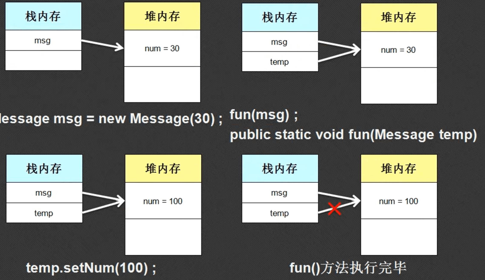
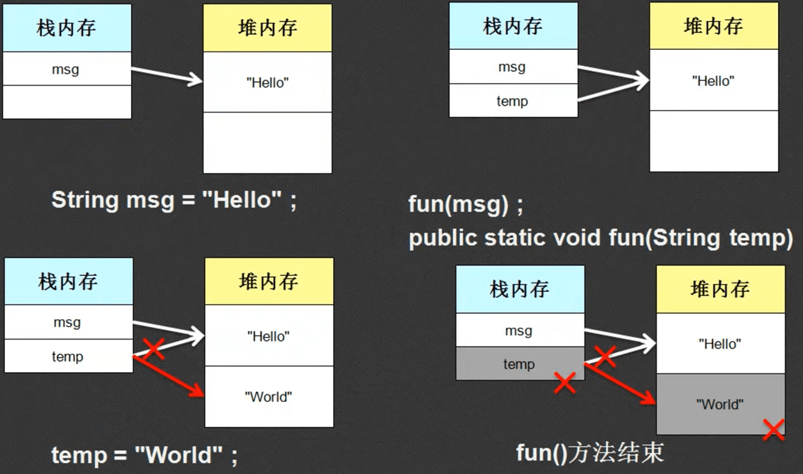
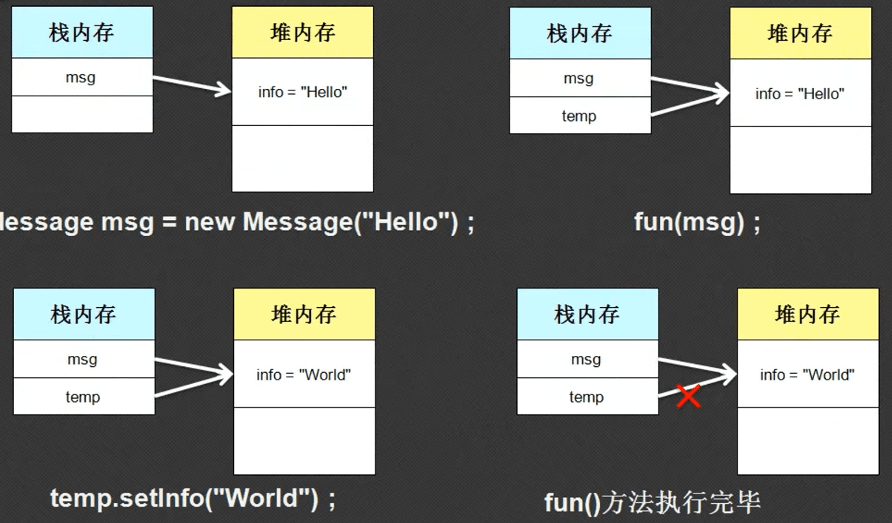
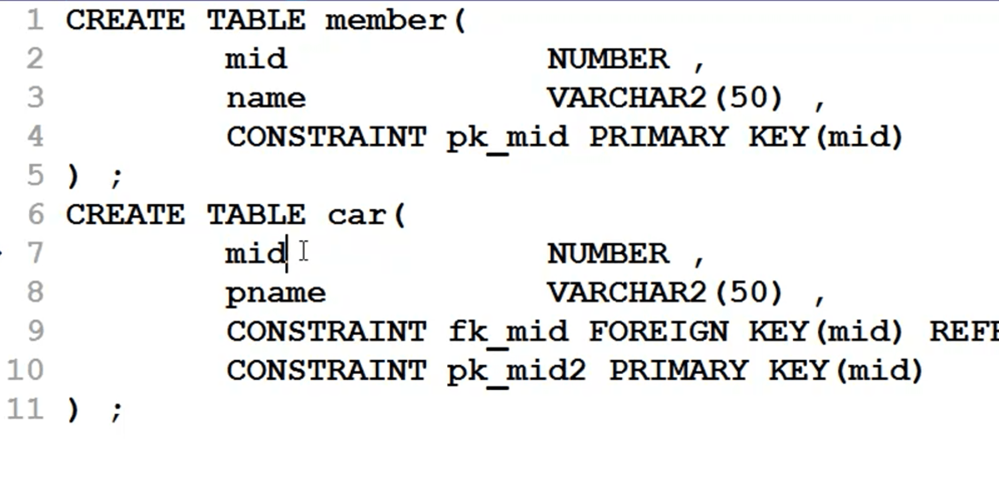

引用的传递是Java的精髓所在，如果不会引用传递，那么就等同于不会Java。下面将通过三个程序，复习巩固Java的引用传递知识。引用传递核心意义：同一块堆内存可以不同的栈内存所指向，不同栈内存可以对统一堆内存进行内容的修改。

## 1. 第一个引用传递范例

```java
class Message{
	private int num = 10;

	public Message(int num){
		this.num = num; 
	}

	public  void setNum(int num){
		this.num = num;
	}

	public  int getNum(){
		return this.num;
	}
}

public class Hello{
	public static void main(String[] args){
		Message msg = new Message(30);
		fun(msg);
		System.out.println(msg.getNum());//输出100
	}
	public static void fun(Message temp){
		temp.setNum(100);
	}
}
```

下面是内存分析



## 2. 第二个引用传递案例

```java
public class Hello{
	public static void main(String[] args){
		String msg = "hello";
		fun(msg);
		System.out.println(msg);//输出为hello
	}
	public static void fun(String temp){
		temp = "world";
	}
}
```

思考问题的落脚点应该在，字符串的内容一旦设置就不可被更改，将字符串传入函数相等于发生了引用传递；将实参的地址给形参。

下面是内存分析



## 3.第三个引用传递案例

```java
class Message{
	private String info = "nihao";

	public Message(String info){
		this.info = info;
	}

	public void setInfo(String info){
		this.info = info;
	}

	public String getInfo(){
		return this.info;
	}
}

public class Hello{
	public static void main(String[] args){
		Message msg = new Message("hello");
		fun(msg);
		System.out.println(msg.getInfo());//输出为world
	}
	public static void fun(Message temp){
		temp.setInfo("world");
	}
}
```

下面是内存分析



## 4. 引用传递的的实际应用

假如说，每个人都有一辆车或者没有汽车，要求用面向对象的方式描述上面的关系。先抛开JAVA不看，该如何设计一个满足如上数据存储的数据库？应该定义两张表，一张用户表、一张车表。



通过上面的分析，那么Java中也需要定义两个类，一个用户类，一个车类。由此我们可以推出一个简单Java类的编写原则：

- 类名称 = 表名称
- 属性名称（类型） = 表字段（类型）
- 一个实例化对象 =  一条记录
- 多个实例化对象（对象数组） = 多行记录
- 应用关系 = 外键约束

如下是Java程序设计

```java
class Member{
	private int mid;
	private String name;
	private Car car; //此成员属性的类型为引用型，个人指定的，不是系统自带的

	// 构造方法为成员属性赋值
	public Member(int mid, String name){
		this.mid = mid;
		this.name = name;
	}

	// 获取该成员的信息
	public String getInfo(){
		return "人员编号："+this.mid+",姓名："+this.name;
	}

	// 设置此人的一辆车
	public void setCar(Car car){
		this.car = car;
	}

	// 返回此人的一辆车
	public Car getCar(){
		return this.car;
	}
}

class Car{
	private String cname;
	private Member member; //此成员属性的类型为引用型，个人指定的，不是系统自带的

	public Car(String cname){
		this.cname = cname;
	}

	public String getInfo(){
		return "车辆名："+this.cname;
	} 

	// 设置本辆车的一个人员归属
	public void setMember(Member member){
		this.member = member;
	}

	// 返回本辆车的归属人
	public Member getMember(){
		return this.member;
	}
}

public class Hello{
	public static void main(String[] args){
		// 实例化一个人的对象
		Member m = new Member(1,"孟祥东");
		// 实例化一个车的对象
		Car c = new Car("宝马");
		// 给刚实例化的人的对象一辆车
		m.setCar(c);
		c.setMember(m);
		// 通过人，找到车的信息
		System.out.println(m.getCar().getInfo()); //输出：车辆名：宝马
		// 通过车找到人的信息
		System.out.println(c.getMember().getInfo()); // 输出：人员编号：1,姓名：孟祥东
	}
}
```

如上设计既可以通过人找到他所属的车的信息，可以根据一辆车找到他对应的主人的信息。

但现在需求升级了，每个人还有孩子，孩子还有一辆车，该如何设计Java程序呢？如下有两种方法：

- 再次设计一个孩子类，如果有孙子在设计一个孙子类，如果有曾孙，再设计一个曾孙类：很明显这种方法不可取
- 由于孩子也是人，也属于Member类，因此改造Member类，添加一个孩子属性。代码如下：

```java
class Member{
	private int mid;
	private String name;
	private Car car; //此成员属性的类型为引用型，个人指定的，不是系统自带的
	private Member child;

	// 构造方法为成员属性赋值
	public Member(int mid, String name){
		this.mid = mid;
		this.name = name;
	}

	// 获取该成员的信息
	public String getInfo(){
		return "人员编号："+this.mid+",姓名："+this.name;
	}

	// 设置此人的一辆车
	public void setCar(Car car){
		this.car = car;
	}

	// 返回此人的一辆车
	public Car getCar(){
		return this.car;
	}

	// 设置孩子的信息
	public void setChild(Member child){
		this.child = child;
	}

	// 返回孩子的信息
	public Member getChild(){
		return this.child;
	}

}

class Car{
	private String cname;
	private Member member; //此成员属性的类型为引用型，个人指定的，不是系统自带的

	public Car(String cname){
		this.cname = cname;
	}

	public String getInfo(){
		return "车辆名："+this.cname;
	} 

	// 设置本辆车的一个人员归属
	public void setMember(Member member){
		this.member = member;
	}

	// 返回本辆车的归属人
	public Member getMember(){
		return this.member;
	}
}

public class Hello{
	public static void main(String[] args){
		// 实例化一个人的对象
		Member m = new Member(1,"孟祥东");
		
		// 实例化一个孩子对象
		Member chd = new Member(2,"孟享");
		
		// 实例化一个车的对象
		Car c = new Car("宝马");

		// 实例化一个孩子的车的对象
		Car cc = new Car("奔驰");

		// 给刚实例化的人的对象一辆车
		m.setCar(c);

		// 给孩子一辆车
		chd.setCar(cc);
		
		// 给m人员一个孩子
		m.setChild(chd);
		
		// c车归属m人
		c.setMember(m);

		// cc车归属于孩子
		cc.setMember(chd);
		
		// 通过人，找到车的信息
		System.out.println(m.getCar().getInfo()); // 输出：车辆名：宝马
		
		// 通过车找到人的信息
		System.out.pxrintln(c.getMember().getInfo()); // 输出：人员编号：1,姓名：孟祥东

		//通过人，找到他孩子的车
		System.out.println(m.getChild().getCar().getInfo()); //输出奔驰

		// 通过孩子的车找到他的人
		System.out.println(cc.getMember().getInfo()); // 输出：人员编号：2,姓名：孟享
	}
}
```

这样的思路在Java中叫做合成设计模式，引用是实现两个不同类之间相互关联的手段。