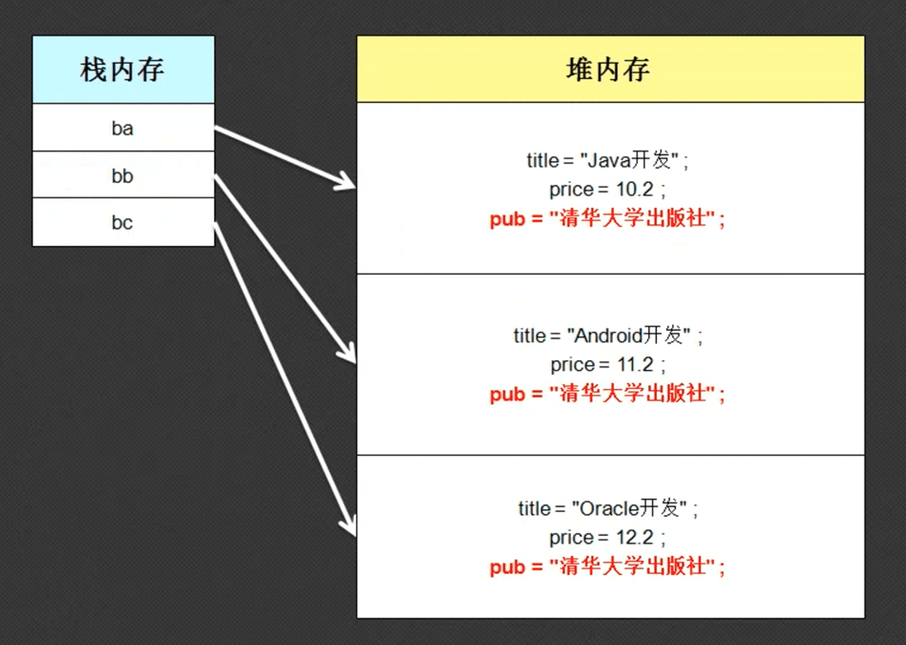
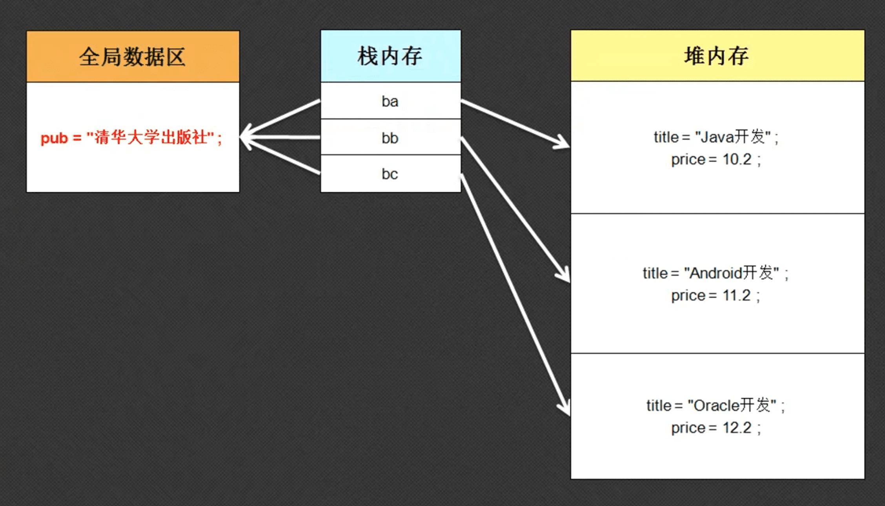

## 1.static定义属性

在讲解static之前，首先观察一个代码

```java
class Book{
	private String title;
	private Double price;
	String pub = "清华大学出版社";

	public Book(String title,Double price){
		this.title = title;
		this.price = price;
	}

	public String getInfo(){
		return "书名："+this.title+"、价格："+this.price+"、出版社："+this.pub;
	}
}

public class Hello{
	public static void main(String[] args){
		Book book1 = new Book("Java",12.2);
		Book book2 = new Book("python",132.2);
		Book book3 = new Book("C++",52.2);
      
        // static修饰共享前
        // 更改一个对象的属性，只对该对象的该属性生效
		book1.pub = "北京大学出版社";	

		System.out.println(book1.getInfo());	// 出版社信息是北京大学...
		System.out.println(book2.getInfo());	// 出版社信息是清华大学...
		System.out.println(book3.getInfo());	// 出版社信息是清华大学...
	}
}
```

下面是内存分析



通过内存发现，每一个对象的出版社信息都是相同的，此时还有必要每个对象都独立占用相同的属性信息吗？如果说我们用这种方法存了1000W个图书的信息，出版社都是一样的，都独自占用着相同的属性。现要求要更变这1000W个书的出版社信息，就需要更改1000W次。

综上所述，用普通的方法定义属性，那么每个对象都将独立地保存各自的属性信息。这种结构式不方便维护的。进一步讲，如果每个对象都有相同的属性，那么应该将其共享。共享的方式就是用static关键字来修饰它

```java
class Book{
	private String title;
	private Double price;
	static String pub = "清华大学出版社";

	public Book(String title,Double price){
		this.title = title;
		this.price = price;
	}

    public String getInfo(){
		return "书名："+this.title+"、价格："+this.price+"、出版社："+this.pub;
	}
}

public class Hello{
	public static void main(String[] args){
		Book book1 = new Book("Java",12.2);
		Book book2 = new Book("python",132.2);
		Book book3 = new Book("C++",52.2);
		
		// static修饰共享后
        // 更改一个对象的属性，对所有对象的所有与此相同的属性一起生效
		book1.pub = "北京大学出版社";

		// 下面的出版社信息都是清华大学
		System.out.println(book1.getInfo());
		System.out.println(book2.getInfo());
		System.out.println(book3.getInfo());
	}
}
```

下面是内存分配



经过static关键字修饰的属性被放到一个独立的内存中，该区域是全局数据区，可以被多个对象同时指向。同时，每个对象就不单独存储该属性信息了。

那么既然static是一个公共的属性，那么在前面的代码中，用一个对象去修改该属性的做法的是不合适的，正确的做法是由所有对象的一个公共代表来修改该属性。这个代表就是类。简单来讲，由static关键字修饰的属性是可以由类直接调用的。因此，我们可使用下面的代码来更改pub属性，修改后对所有的对象都生效。

```java
Book.pub = "北京大学出版社";
```

static和非static修饰的属性有一个最大的区别：static修饰的属性在无需实例化对象的情况下，直接由类调用。那么什么时候用static修饰，什么时候不用呢？

在编写类的过程中，你所选择的首要修饰符一定不是static，也就是95%的情况下不用static修饰。如果要描述出共享信息的时候再用static，因为这样可以被集体修改，也可以节省空间。

## 2.static定义方法

static定义方法也可以在没有实例化的时候被类直接调用。

```java
class Book{
	private String title;
	private Double price;
	private static String pub = "清华大学出版社";

	public Book(String title,Double price){
		this.title = title;
		this.price = price;
	}

	public String getInfo(){
		return "书名："+this.title+"、价格："+this.price+"、出版社："+this.pub;
	}

	public static void setPub(String p){
		pub = p;
	}
}

public class Hello{
	public static void main(String[] args){
		// 调用由static修饰的方法，修改由static修饰的属性
		Book.setPub("北京大学");

		Book book1 = new Book("Java",12.2);
		Book book2 = new Book("python",132.2);
		Book book3 = new Book("C++",52.2);
			
		// 下面的出版社信息都是北大
		System.out.println(book1.getInfo());
		System.out.println(book2.getInfo());
		System.out.println(book3.getInfo());
	}
}
```

可以发现，由static修饰的方法和属性都不受实例化类的限制，可由类直接调用。但此时就会出现一个特别麻烦的问题，类中的方法就变成了两组：一个是static方法，一个是非static。两组方法之间的相互访问也会受到限制：

- static方法不能访问非static修饰的属性或方法，只能调用static属性和方法

```JAVA
class Book{
	private String title;
	private Double price;
	private static String pub = "清华大学出版社";

	public Book(String title,Double price){
		this.title = title;
		this.price = price;
	}

	// 由static修饰的方法不可访问非static修饰的属性
	public static String getInfo(){
		return "书名："+this.title+"、价格："+this.price+"、出版社："+this.pub;
	}

}

public class Hello{
	public static void main(String[] args){
		Book.getInfo();	//报错
	}
}
```
- 非static方法可以访问非static修饰的属性或方法，不受任何限制

```java
class Book{
	private String title;
	private Double price;
	private static String pub = "清华大学出版社";

	public Book(String title,Double price){
		this.title = title;
		this.price = price;
	}

	public static String getInfo(){
		return "出版社："+pub;
	}

	// 非static可以调用static修饰方法
	public String getPub(){
		return this.getInfo();
	}
}

public class Hello{
	public static void main(String[] args){
		Book.getInfo();	// 无错
	}
}
```

为什么会这样呢？

- 所有的非static修饰的属性和方法，只有在实例化了对象之后才会分配空间，才能被访问。
- 所有的static修饰的方法，在没有实例化对象的时候就已经有了空间，可被访问

在主类中的方法，一般会加上static方法进行修饰，如果不加会报错，如下：

```java
public class Hello{
	public static void main(String[] args){
		fun();//报错
	}

	public void fun(){
		System.out.println("hello");
	}
}
```

如果先实例化主类，在调用fun方法，就不会报错

```java
public class Hello{
	public static void main(String[] args){
		new Hello().fun();//无错
	}

	public void fun(){
		System.out.println("hello");
	}
}
```

那到底什么时候用static修饰方法呢？

- 定义类的时候，首先考虑非static方法
- 如果某个类中的方法，需要用到本类中的非static属性的时候，不要用static定义方法

```java
class Book{
	private boolean flag;

	public Book(boolean falg){
		this.flag = flag;
	}

	public void fun(){
		if(this.flag){
			System.out.println("可以操作");
		}else{
			System.out.println("不可以操作");
		}
	}
}

public class Hello{
	public static void main(String[] args){
		Book b1 = new Book(true);
		Book b2 = new Book(false);

		b1.fun();
		b2.fun();
	}

}
```

- 如果一个类中只有方法，没有属性，那完全可以定义static方法，因此这样不用产生类就能调用方法了。

```java
class Book{
	public static int sum(int x, int y){
		return x + y;
	}
}

public class Hello{
	public static void main(String[] args){
		System.out.println(Book.sum(5,6));
	}
}
```

## 3.主方法

方法组成如下：

- public:主方法是程序的开始，所以一定要对任何的操作都是可见的，所以要用public描述一个公共的概念。
- static：证明此方法是由类名称调用的，因为执行一个类的时候是执行：java+一个类名称
- void：没有返回值
- main：系统指定好的方法名称，不能修改。
- String[] args：程序运行时传递的参数。

我们可以在执行编译文件的时候，在主类名后面加上，以空格隔开的参数，如果参数本身带有空格，那么可以使用双引号括起来。

```java
public class Hello{
	public static void main(String[] args){
		for(int i = 0; i<args.length; i++){
			System.out.println(args[i]);
		}
	}
}
//终端下输入 
java Hello "hello world" hello word

//输出为
hello world
hello
word
```

## 3.static的实际应用

- 不管有多少对象，都是用同一类中用static定义的属性
- 使用static方法可以避免掉实例化对象调用方法的限制

### 3.1 实现类实例化对象个数的统计

希望每当实例化一个对象的时候可以打印一个信息，产生的第x个实例化对象。

因为只要是产生一个新的实例化对象，就会调用一次构造方法，因此我们可以在构造方法里面，给实例化对象的次数加一。

```java
class Book{
	private String title;
	private static int num = 0;
	public Book(String title){
		this.title = title;
		this.num = ++this.num;
		System.out.println("这是实例化的第"+this.num+"个对象");
	}
}

public class Hello{
	public static void main(String[] args){
		Book boo1 = new Book("java");
		Book boo2 = new Book("java");
		Book boo3 = new Book("java");
		Book boo4 = new Book("java");
	}
}

//输出
这是实例化的第1个对象
这是实例化的第2个对象
这是实例化的第3个对象
这是实例化的第4个对象
```

## 4.总结

- 开发中首选的属性不是static属性、方法不是static方法
- static属性和方法可以在没有实例化的情况下直接被类调用。
- static属性保存在全局数据区
- 内存有四块区域：栈内存、堆内存、全局数据区、全局代码区

