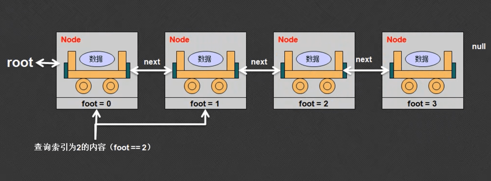

此部分属于引用部分的加强应用，依赖于下面两个知识点：

- 引用传递问题
- this表示当前对象

## 1.链表的基本形式

链表是一种最为简单的数据结构，它主要依靠引用关系来实现多个数据的保存，假设现在要保存的数据使字符串。


举例：定义一个node类，本次保存的是字符串，同时拥有下一个引用，下一个node还是node

```java
// 每一个链表是由多个节点组成的
class Node{ 
    private String data;  // 保存数据
    private Node next;	  // 保存下一个节点

    // 生成节点的同时给他一个值
    public Node(String data){
      this.data = data;
    }

    // 设置下一个节点
    public void setNext(Node next){
      this.next = next;
    }

    // 获取下一个节点
    public Node getNext(){
      return this.next;
    }

    // 获取数据
    public String getData(){
      return this.data;
    }
}
```

上面是一个专门保存节点关系的类，但是，只与怎么保存的关系，现在还不是由Node进行，由其他类负责关系的匹配。下面有两种方式实现匹配。

- 第一种：设置和取出数据

```java
public class Hello{
    public static void main(String[] args){
      // 生成节点、设置数据
      Node root = new Node("火车头");
      Node r1 = new Node("车厢A");
      Node r2 = new Node("车厢B");

      // 设置节点关系
      root.setNext(r1);
      r1.setNext(r2);

      // 取出数据
      Node currentNode = root;
      while(currentNode != null){
        System.out.println(currentNode.getData());
        currentNode = currentNode.getNext();
      }
    }
}
```

但是上述的方法使用的方法并不方便，最好的做法还是应该用递归操作来完成。

- 第二种：设置和取得数据

```java
public class Hello{
    public static void main(String[] args){
      // 生成节点、设置数据
      Node root = new Node("火车头");
      Node r1 = new Node("车厢A");
      Node r2 = new Node("车厢B");

      // 设置节点关系
      root.setNext(r1);
      r1.setNext(r2);

      // 取出数据
      print(root);
    }

    public static void print(Node currentNode){
      //设置递归结束条件
      if(currentNode == null){
        return;
      }
      System.out.println(currentNode.getData());
      print(currentNode.getNext());
    }
}
```

由于不知道循环结束的条件，所以用while循环，但是习惯上我们用递归来代替while

## 2.链表的基本雏形

通过分析发现，上述的方式是有缺陷的，因为节点的实例化和节点之间的关系都是在main方法中进行的，main方法是客户端，直接面向用户，但是：

- 用户在操作的过程中完全没有必要去关心Node类是否存在
- 所有节点的关系不应该由用户去处理，而应该由一个专门的工具类来操作。

```java
// 每一个链表是由多个节点组成的
class Node{ 
	private String data;  // 保存数据
	private Node next;	  // 保存下一个节点

	// 生成节点的同时给他一个值
	public Node(String data){
		this.data = data;
	}

	// 实现节点的添加，添加的是一个Node
	// 第一次调用（Link）：this = Link.root
	// 第二次调用（Node）：this = Link.root.next
	// 第三次调用（Node）：this = Link.root.next.next
	public void addNode(Node newNode){
		if(this.next == null){
			this.next = newNode; //如果后面还有座，保存新节点
		}else{					//如果不为空，
			// 当前节点的下一个节点继续保存数据
			this.next.addNode(newNode);
		}
	}

	// 第一次调用（Link）：this = Link.root
	// 第二次调用（Node）：this = Link.root.next
	// 第三次调用（Node）：this = Link.root.next.next
	public void printNode(){
		System.out.println(this.data);
		// 如果还有下一个
		if(this.next != null){
			this.next.printNode(); //输出下一个
		}
	}
}

// Link负责数据的设置和输出
class Link{
	private Node root;
	// 增加数据
	public void add(String data){
		// 为了可以设置数据的先后关系，所以将data包装在一个node类对象中
		Node newNode = new Node(data);
		// 保存当前数据的时候，还没有根节点
		if(this.root == null){ //一个链表只能有一个根节点
			this.root =newNode; // 将新的节点设置为root
		}else{ //根节点存在了，定义下一个节点的工作应该交给Node来处理
			// 从root节点之后找到合适的位置
			this.root.addNode(newNode);
		}
	}

	// 数据的输出 还是Node的事儿
	public void print(){
		if(this.root != null){
			this.root.printNode();
		}else{
			System.out.println("暂无数据");
		}
	}
}

public class Hello{
	public static void main(String[] args){
		Link link = new Link();
		link.add("java");
		link.add("html");
		link.add("css");
		link.add("python");
		link.print();
	}
}
```

下面是示意图：


链表的基本操作特点：

- 客户端代码不用关心具体的node以及引用关系的细节，只关注与提供的Link类提供的方法
- Link类的主要功能是控制Node类对象的产生和根节点的使用
- Node类主要负责数据的保存和引用关系的分配。

## 3.开发可用链表

就是实现链表的增删改查。

###3.1 程序的基本结构

之前的程序中是在Link类中操作Node类，但是在主程序中我们仍然还是可以操作Node类，因此我们需要对此进行限制，使其只能在Link类中使用，而不能在其他地方使用。这个时候使用一个被private关键字修饰的内部类就能实现此功能。这样的话，一个内部类只能够被外部类所使用。另外一点，内部类还可以与外部类进行私有属性的访问。

```java
class Link{
	// 定义内部类Node，使其为Link服务
	private class Node{
		private String data;
		private Node next;

		public Node(String data){
			this.data = data;
		}
	}

	//===========以上是内部类=========
	private Node root;   //需要根节点
}

```

由于内部类和外部类可共享属性，所以不用再内部类中额外定义一个设置next和获得next的方法。这两个功能可以在Link这个外部类中实现。

### 3.2 数据的增加

在链表中增加数据，我们使用public void add( )方法。

```java
class Link{
	// 定义内部类Node，使其为Link服务
	private class Node{
		private String data;
		private Node next;

		public Node(String data){
			this.data = data;
		}

		// 开辟新的节点
		public void addNode(Node newNode){
			//如果此节点已经有了next，那就么就用Next开辟节点，一次类推
			if(this.next == null){
				this.next = newNode;
			}else{
				this.next.addNode(newNode);
			}
		}
	}

	//===========以上是内部类=========
	private Node root;   //需要根节点

	//增加新的节点
	public void add(String data){
			Node newNode = new Node(data);
		
		//判断是否有root节点，有就开辟新的节点
      if(this.root == null){
          this.root = newNode;
      }else{
        this.root.addNode(newNode);
			}
	}
}

public class Hello{
	public static void main(String[] args){
      Link link = new Link();
      link.add("Hello");
      link.add("world");
	}
}
```

### 3.3 获取链表长度

获取链表的长度，或者说获取链表元素的个数，我们可以在Link类中定义一个public int length()方法：

方法一：每次想要获取长度的时候重新计算链表的长度，需要在Link类中添加下面的方法:

```java
public int length(){
		int len = 0;
		Node currNode = this.root;
		while(currNode != null){
			len++;
			currNode = currNode.next;
		}
		return len;
}
```

方法二：每次添加一个Node的时候实现一个专门计算长度的变量的自增，在Link类中添加一个count变量，在原有add方法添加一个count++，在Link类中添加一个返回数量的函数：

```java
private int count;	//计算节点的长度
//增加新的节点
public void add(String data){
		Node newNode = new Node(data);
		//判断是否有root节点，有就开辟新的节点
		if(this.root == null){
				this.root = newNode;
		}else{
				this.root.addNode(newNode);
		}
		this.count++;
}

public int length(){
		return this.count;
}
```

### 3.4 判断链表是否为空

空链表的判断可以通过两种方式来完成：

- 判断root节点是否为空。
- 判断长度count是否为0。

```java
public boolean isEmpty(){
		return this.count == 0;
}
```

###3.5 查询链表数据

判断某一数据是否存在于一个链表中：public boolean contain(*)。以String为例，循环链表中的内容，将每一个内容与要查询的内容进行（equals），查询到就是true，否者为false。下面是一个原理示意图：


首先在Link类中添加下面的方法:

```java
	// 链表内容查询
public boolean contains(String data){
		// 判断是否符合查询条件
		if(data == null || this.root == null){
				return false;	// 不符合返回false
		}else{	// 符合的话交给Node节点
				return this.root.nodeContains(data);
		}
}
```

上面表示从跟节点开始查寻数据是否存在，然后在Node类中添加下面的方法，因为查看数据的工作还是要交给Node自己来完成：

```java
		// 查询数据是否存在
public boolean nodeContains(String data){
    if(this.data.equals(data)){
      	return true;
    }else{
        if(this.next == null){
            return false;
        }else{
            return this.next.nodeContains(data);
        }
    }
}
```

本次查询的是字符串数据类型，因此使用的是equals，但是如果查询的是自定义对象呢？我们需要定义一个对象比较的方法 （暂时将方法定义为compare）。

### 3.6 根据索引取出数据

通过上面的代码我们发现，链表中的每一个节点都是一个Node对象，在程序之中只有数组能保存多个对象。与数组相比，使用链表的一大优势就是没有长度限制，所以说链表是一种动态对象数组。既然是数组，也应该具备通过索引取得元素的功能。因此我们接下来定义一个get方法，来完成此功能。



在Link类中添加一个foot属性，表示每一个Node元素的编号，然后在Link类中添加一个get方法：

```java
private int foot;
//根据索引查询内容
public String get(int index){
    // 判断所给索引是够超过链表最大长度
    if(index >= this.count){
      	return null;
    }
    // 每次查询都从0开始
    this.foot = 0;
    // 符合条件，交给Node去查询
    return this.root.getNode(index);
}
```

然后在Node内部类中添加一个getNode()方法：

```java
// 根据索引查询内容
public String getNode(int index){
    // 内部类可以与外部类互相进行私有属性访问
    if(Link.this.foot++ == index){
      	return this.data;
    }else{
      	return this.next.getNode(index);
    }
}
```

这样的话，就能够与数组紧密联系在一起了。其实，写了半天就是写了一个动态的对象数组。

### 3.7 修改指定索引内容

修改数据其实跟查询数据的原理是一样的，只不过是将查询到的数据进行修改，而不是进行返回，所以该函数的返回值是void。因此在Link类中增加set方法：

```java
	// 根据索引修改内容
public void set(int index, String data){
    if(index >= this.count){
      	return;
    }else{
      	this.root.setNode(index,data);
    }
}
```

然后在Node中增加setNode方法：

```java
// 根据索引修改内容
public void setNode(int index, String data){
    if(Link.this.foot++ == index){
      	this.data = data;
    }else{
      	this.next.setNode(index,data);
    }
}
```

### 3.8 数据的删除

对于删除数据而言，实际上分为两种情况：

- 要删除的节点是根节点，删除根节点，需要让root指向根节点的next节点。Link类才关心根节点，所以此处在Link类中实现


- 要删除的是其他节点，那么该节点的上面一个节点的next指针，指向该节点的下一个节点。此时应该在Node类中处理


在Node类中添加一个removeNode方法，此方法专门负责非根节点的删除。

```java
// 要传递需要删除的数据和上一个节点
public void removeNode(Node previous,String data){
    if(this.data.equals(data)){
      	previous.next = this.next;
    }else{
      	this.next.removeNode(this,data);
    }
}
```

然后在Link中写remove函数，此函数主要用来删除根节点：

```java
// 根据内容删除节点
public void remove(String data){
	// 判断内容是否在链表中存在
	if(this.contains(data)){
		if(this.root.data.equals(data)){
			this.root = this.root.next;
		}else{
			this.root.next.removeNode(this.root,data);
		}
	}else{
		return;
	}
	// 删除之后，链表的数量要减少
	this.count--;
}
```

###3.9 将链表转换为对象数组

任何情况下，不管是什么样的类，都不可能在类中使用输出语句，只要是想输出数据，就一定要在调用处输出。而由于链表属于动态，所以最好的是将链表以对象数组的形式返回。


通过上面的分析发现，最终Link类的toArray()方法一定要返回一个对象数组，并且这个对象数组也一定要能被Node所使用，因此我们将此数组定义为Link类中的属性。

```java
private String retArray[]; //定义一个对象数组
// 将链表转换为对象数组
public String [] toArray(){
	if(this.root == null){
		return null;
	}
	
	this.foot = 0;
	this.retArray = new String [this.count];
	this.root.toArrayNode();
	return retArray;
}
```

然后在Node中定义toArrayNode()

```java
// 将链表转换为对象数组
public void toArrayNode(){
	Link.this.retArray[Link.this.foot++] = this.data;
	if(this.next != null){
		this.next.toArrayNode();
	}
}
```

此功能实现的前提是内部类和外部类可以直接进行私有属性的访问。链表数据变为对象数组取出，是最为重要的功能。

## 4.链表的使用

以上所定义的链表严格来说是不够用的，因为它所能存储的只能是字符串，所以接下来我们将使用自定义类来进行链表的操作。首先我们先定义一个Book的数据类型：

```java
// 自定义Book数据类型
class Book{
	private String title;
	private Double price;

	// 构造方法
	public Book(String title, Double price){
		this.title = title;
		this.price = price;
	}

	// 返回信息
	public String getInfo(){
		return "书名："+this.title+"，书价："+this.price;
	}

	// 对象比较
	public boolean compare(Book data){
		if(this == data){
			return true;
		}

		if(data == null){
			return false;
		}

		if(this.title.equals(data.title) && this.price == data.price){
			return true;
		}

		return false;
	}
}
```

然后我们更改Link类，将所有的String类型改为Book类型，将所有的equals方法改为compare方法：

```java
class Link{
	// 定义内部类Node，使其为Link服务
	private class Node{
		private Book data;
		private Node next;

		public Node(Book data){
			this.data = data;
		}

		// 开辟新的节点
		public void addNode(Node newNode){
			//如果此节点已经有了next，那就么就用Next开辟节点，一次类推
			if(this.next == null){
				this.next = newNode;
			}else{
				this.next.addNode(newNode);
			}
		}

		// 查询数据是否存在
		public boolean nodeContains(Book data){
			if(this.data.compare(data)){
				return true;
			}else{
			 	if(this.next == null){
					return false;
			 	}else{
					return this.next.nodeContains(data);
				}
			}
		}

		// 根据索引查询内容
		public Book getNode(int index){
			// 内部类可以与外部类互相进行私有属性访问
			if(Link.this.foot++ == index){
				return this.data;
			}else{
				return this.next.getNode(index);
			}
		}

		// 根据索引修改内容
		public void setNode(int index, Book data){
			if(Link.this.foot++ == index){
				this.data = data;
			}else{
				this.next.setNode(index,data);
			}
		}

		// 要传递需要删除的数据和上一个节点
		public void removeNode(Node previous,Book data){
			if(this.data.compare(data)){
				previous.next = this.next;
			}else{
				this.next.removeNode(this,data);
			}
		}

		// 将链表转换为对象数组
		public void toArrayNode(){
			Link.this.retArray[Link.this.foot++] = this.data;
			if(this.next != null){
				this.next.toArrayNode();
			}
		}
	}

	//===========以上是内部类=========
	private Node root;   //需要根节点
	private int count;	//计算节点的长度
	private int foot;	//定义脚标
	private Book retArray[]; //定义一个对象数组
	//增加新的节点
	public void add(Book data){
		Node newNode = new Node(data);
		
		//判断是否有root节点，有就开辟新的节点
		if(this.root == null){
			this.root = newNode;
		}else{
			this.root.addNode(newNode);
		}
		this.count++;
	}

	public int length(){
		return this.count;
	}

	// 判断链表是否为空
	public boolean isEmpty(){
		return this.count == 0;
	}

	// 链表内容查询
	public boolean contains(Book data){
		// 判断是否符合查询条件
		if(data == null || this.root == null){
			return false;	// 不符合返回false
		}else{	// 符合的话交给Node节点
			return this.root.nodeContains(data);
		}
	}

	//根据索引查询内容
	public Book get(int index){
		// 判断所给索引是够超过链表最大长度
		if(index >= this.count){
			return null;
		}
		// 每次查询都从0开始
		this.foot = 0;
		// 符合条件，交给Node去查询
		return this.root.getNode(index);

	}

	// 根据索引修改内容
	public void set(int index, Book data){
		if(index >= this.count){
			return;
		}else{
			this.foot = 0;
			this.root.setNode(index,data);
		}
	}

	// 根据内容删除节点
	public void remove(Book data){
		// 判断内容是否在链表中存在
		if(this.contains(data)){
			if(this.root.data.equals(data)){
				this.root = this.root.next;
			}else{
				this.root.next.removeNode(this.root,data);
			}
		}else{
			return;
		}
		// 删除之后，链表的数量要减少
		this.count--;
	}

	// 将链表转换为对象数组
	public Book [] toArray(){
		if(this.root == null){
			return null;
		}
		
		this.foot = 0;
		this.retArray = new Book [this.count];
		this.root.toArrayNode();
		return retArray;
	}

}
```

然后我们可以在主类的主方法中测试这个链表的功能了。

```java
public class Hello{
	public static void main(String[] args){
		Link link = new Link();
		link.add(new Book("java",11.2));
		link.add(new Book("python",21.2));
		link.add(new Book("django",31.2));
		System.out.println(link.length());	// 获取链表长度
		System.out.println(link.contains(new Book("python",21.2))); // 查看某数据是否在链表中
		link.remove(new Book("django",31.2));	//删除某一数据
		Book book[] = link.toArray();
		for(int i =0; i<book.length; i++){		// 输出所有数据
			System.out.println(book[i].getInfo());
		}
	}
}
```

## 5.总结

-   本次讲解的只是最基础的单项链表
-   本次讲解的链表是日后进行java类集学习的先期原理分析
-   熟记下面的方法名称以及作用


