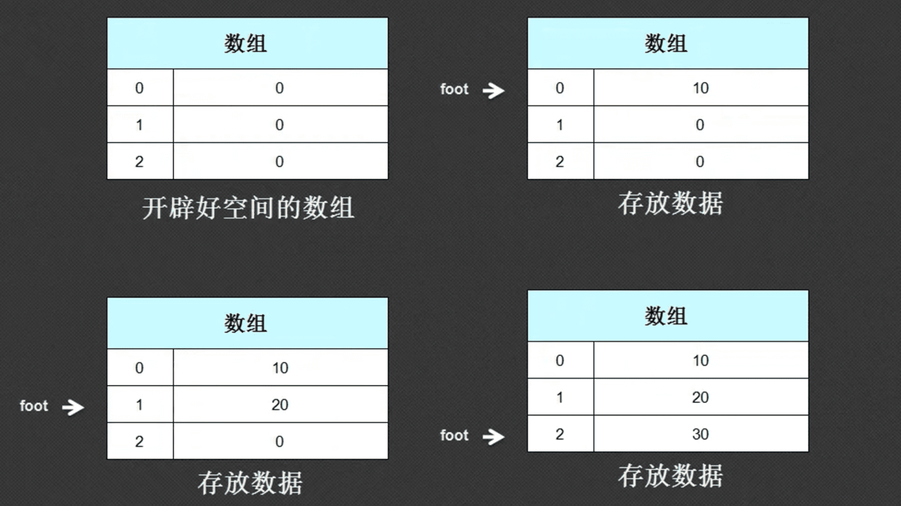

此任务要求定义一个数组操作类(Array)，在这个类里面可以进行整型数组的操作，由外部传入数组的大小，并且实现数据的保存，以及数据的输出。随后在这个类上派生出两个子类：

-   排序类：通过此类取得的数据可以进行排序。
-   翻转类：通过此类取得的数组数据要求采用倒序的方式输出。

在实际开发的时候肯定不会去考虑子类，因此我们先开发父类：

## 1. 开发父类



父类实现生成数组，为数组赋值，获取数组的功能。

```java
class Array{
	private int data[];	// 数组
	private int foot = 0;	// 用于索引的脚标

	// 构造方法传入数组长度
	public Array(int len){
		this.data = new int[len];
	}

	//实现添加数据的功能
	public boolean add(int val){
		if(this.foot < data.length){
			data[this.foot++] = val;
			return true;
		}else{
			return false;
		}
	}

	// 获取所有数据
	public int[] getData(){
		return this.data;
	}
}

public class Hello{
	public static void main(String args[]){
		Array arr = new Array(3);
		//数据的存入
		System.out.println(arr.add(123));	//true
		System.out.println(arr.add(123));	//true
		System.out.println(arr.add(123));	//true
		System.out.println(arr.add(123));	//false

		int temp[] = arr.getData();
		//输出所有的数据
		for(int i=0; i<temp.length; i++){
			System.out.println(temp[i]);
		}
	}

}
```

## 2. 开发排序子类

排序子类的实现是要求在获取数组的同时能够将数组中数据进行排序，因此我们只需要覆写父类中的getData方法就可以了：

```java
class Array{
	private int data[];	// 数组
	private int foot = 0;	// 用于索引的脚标

	// 构造方法传入数组长度
	public Array(int len){
		this.data = new int[len];
	}

	//实现添加数据的功能
	public boolean add(int val){
		if(this.foot < data.length){
			data[this.foot++] = val;
			return true;
		}else{
			return false;
		}
	}

	// 获取所有数据
	public int[] getData(){
		return this.data;
	}
}

class SortArray extends Array{
	//由于继承后子类会自动调用父类的无参构造，但是父类没有
	//因此需要明确的调用父类的有参构造
	public SortArray(int len){
		// 这样父类中的data就可以初始化空间了
		super(len);
	}

	// 覆写getData方法
	public int [] getData(){
		java.util.Arrays.sort(super.getData());
		return super.getData();
	}

}

public class Hello{
	public static void main(String args[]){
		SortArray arr = new SortArray(3);
		//数据的存入
		System.out.println(arr.add(3));	//true
		System.out.println(arr.add(5));	//true
		System.out.println(arr.add(1));	//true

		int temp[] = arr.getData();
		//输出所有的数据
		for(int i=0; i<temp.length; i++){
			System.out.println(temp[i]); // 输出的是135
		}
	}
}
```

在这个程序里面，我们的思路是：

-   绝对不改变客户端已有的使用方法
-   子类对父类进行了覆写

## 3.开发反转子类

我们只需要写一个ReverseArray类，继承Array就可以：

```java
class ReverseArray extends Array{
	public ReverseArray(int len){
		super(len);
	}

	public int [] getData(){
		int length = super.getData().length;
		int temp[] = new int[length];
		int i = 0;
		while(length>=1){
			temp[i] = super.getData()[length-1];
			i++;
			length--;
		}
		return temp;
	}
}
```

## 4.总结

-   子类的功能就是根据特殊的情况进行父类功能的扩充
-   子类扩充扩充方法的时候，没有超过父类的定义范畴。尽量以父类的方法名称为主，可根据实际情况对父类方法覆写。

