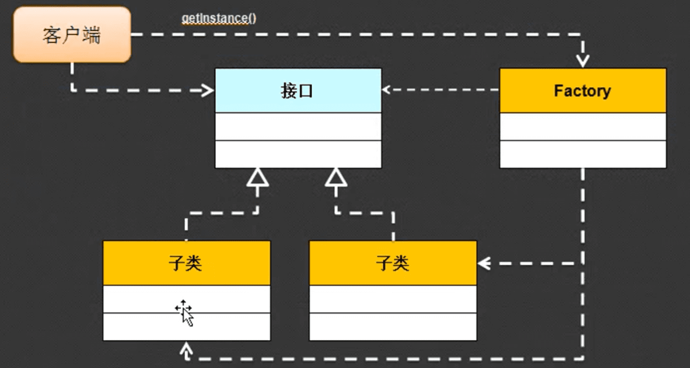

## 1.接口的应用-标准

上一节说到，接口在实际应用中有三大核心，其中一个就是定义不同层之间的标准，这是什么意思呢？举例来说，一个电脑中有一个USB接口，这个接口可以对接打印机，U盘，移动硬盘，手机等等设备。电脑和这些设备就属于不同层，如图所示：


所有的代码要进行开发，一定要首先开发出USB接口标准，因为有了标准，设备商才能够去开发USB设备。

举例：定义USB的标准：

```java
// 定义USB标准，可以连接不同层
interface USB{
	public abstract void start();
	public abstract void stop();
}

// 定义电脑，可以使用USB设备
class Computer{
	// 接收的是实现了USB接口的USB设备设备
	public void plugin(USB usb){
		usb.start();
		usb.stop();
	}
}

// 定义打印机,实现USB接口
class Print implements USB{
	public void start(){
		System.out.println("打印机开始工作");
	}	

	public void stop(){
		System.out.println("打印机停止工作");
	}
}

// 定义U盘，实现USB接口
class U implements USB {
	public void start(){
		System.out.println("U盘开始工作");
	}

	public void stop(){
		System.out.println("U盘停止工作");
	}
}


public class Hello{
	public static void main(String[] args){
		Computer com = new Computer();
		com.plugin(new Print());
		com.plugin(new U());
	}
}
```

输出结果：

```java
打印机开始工作
打印机停止工作
U盘开始工作
U盘停止工作
```

## 2.接口的应用-工厂设计模式

现在要求写一个水果的接口，该接口可实现吃的功能，其子类是各种水果类。

```java
// 定义水果接口
interface Fruit{
	public abstract void eat();
}

// 定义苹果类
class Apple implements Fruit{
	public void eat(){
		System.out.println("吃苹果");
	}
}

// 定义橘子类
class Orange implements Fruit{
	public void eat(){
		System.out.println("吃橘子");
	}
}

// 定义香蕉类
class Banana implements Fruit{
	public void eat(){
		System.out.println("吃香蕉");
	}
}
```

现要求在主类的主方法中实现这样的功能，用户输入水果的名字，然后就能立马调用相关水果的接口，然后吃掉水果。按最笨的方法可以这样在客户端中实现：

```java
public class Hello{
	public static void main(String[] args){
		// 吃苹果
		Fruit f = new Apple();
		f.eat();

		// 吃橘子
		Fruit f = new Orange();
		f.eat();

		// 吃香蕉
		Fruit f = new Banana();
		f.eat();
	}
}
```

虽然说，这样也能实现此功能，但是不符合主类主方法，也就是客户端的实现原则，客户端的代码应该越少越好，越不用改动越好。因此，我们可以定义一个另外的一个类，类里面定义一个静态方法，这个类的作用就是根据不同的水果名称返回不同的水果类。

```java
class Factory{
	// 定义静态方法，不用实例化就能调用
	public static Fruit getFruit(String name){
		if("apple".equals(name)){
			return new Apple();
		}else if ("orange".equals(name)){
			return new Orange();
		}else if ("banana".equals(name)){
			return new Banana();
		}else{
			return null;
		}
	}
}
```

然后客户端里面可以写：

```java
public class Hello{
	public static void main(String[] args){
		// 吃苹果
		Fruit f = Factory.getFruit("apple");
		f.eat();
	}
}
```

这样就大大客户端内的代码，但是还不够完美，这样定义之后我们还需要修改getFruit里面的名字，代码耦合度太高。不方便维护。如果能在运行的时候输入名字就好了，于是可以这样修改客户端代码：

```java
public class Hello{
	public static void main(String[] args){
		// 吃苹果
		Fruit f = Factory.getFruit(args[0]);
		f.eat();
	}
}
```

在运行的时候这样写就可以

```java
javac Hello.java
java Hello apple
	// 输出吃苹果
java Hello orange
	// 输出吃橘子
java Hello banana
	// 输出吃香蕉
```

这就是工厂模式。



##3.接口的应用-代理设计模式

现在拿皇上要临幸妃子举例，实际上皇上要临幸这件事情在古代没有这么简单，他需要内部先告诉妃子，然后让妃子洗澡，然后把妃子送到皇宫，然后皇帝临幸，临幸完内务要把妃子接走，皇帝干的是核心步骤，其他步骤都代理给了内务去干，但是对于外人来说，我们只看到了皇帝临幸了妃子这件事情如图：


那么转化到程序中应该这样来写：

```java
// 定义核心主题
interface Subject{
	public void make();
}

// 定义关键性人物-皇帝
class RealSubject implements Subject {
	public void make(){
		System.out.println("正在临幸");
	}
}

// 定义代理人物-内务
class ProxySubject implements Subject{
	// 辅助对象
	private Subject subject;
	// 构造方法，要接收一个真实主题的操作对象
	public ProxySubject(Subject subject){
		this.subject = subject;
	}

	// 临幸前的准备
	public void prepare(){
		System.out.println("为临幸做准备");
	}

	// 临幸中-覆写接口的方法
	public void make(){
		this.prepare();
		this.subject.make();
		this.destory();

	}
	
	// 临幸后的收尾
	public void destory(){
		System.out.println("临幸后的收尾");
	}

}

public class Hello{
	public static void main(String[] args){
		Subject sub = new ProxySubject(new RealSubject());
		sub.make();
	}
}
```

输出结果是：

```java
为临幸做准备
正在临幸
临幸后的收尾
```

代理设计模式的核心在于有一个主题操作接口（可能有多种方法），核心业务主题只完成核心功能，比如去食堂吃饭，我们只关注吃就行了，不用管饭是怎么做的，吃完怎么刷完等问题。而代理主题完成辅助性操作。


## 4.抽象类和接口的区别

| No   | 区别       | 抽象类                                               | 接口                                   |
| ---- | ---------- | ---------------------------------------------------- | :------------------------------------- |
| 1    | 关键字     | abstract class                                       | interface                              |
| 2    | 组成       | 构造方法、普通方法、抽象方法、static方法、常量、变量 | 全局常量、抽象方法                     |
| 3    | 子类使用   | class 子类 extends 抽象类                            | class 子类 implements 接口             |
| 4    | 关系       | 抽象类可继承多个接口                                 | 接口可以继承多个接口，但不能继承抽象类 |
| 5    | 权限       | 可以使用各种权限：default、public                    | 只有public权限                         |
| 6    | 限制       | 单继承局限                                           | 无单继承局限                           |
| 7    | 子类       | 必须有子类必须有子类，且子类必须覆写全部抽象方法     | 同左                                   |
| 8    | 实例化对象 | 依靠子类对象的向上转型实例化对象                     | 同左                                   |

通过比对可知，抽象类比接口可实现的功能要多，但是唯一的限制就是单继承局限。所以，以后有限定义接口。

-   在进行某些公共操作的时候，要定义出接口
-   有了接口就需要利用子类完善方法
-   如果是自己写的接口，绝对不要去使用关键字new 直接实例化接口子类，而要用工厂类完成。

## 5.总结

-   接口与抽象类定义的不同
-   接口作为标准用于解耦合，以及不同层之间的桥梁
-   一定要将工厂设计模式、代理设计模式的结构记下来