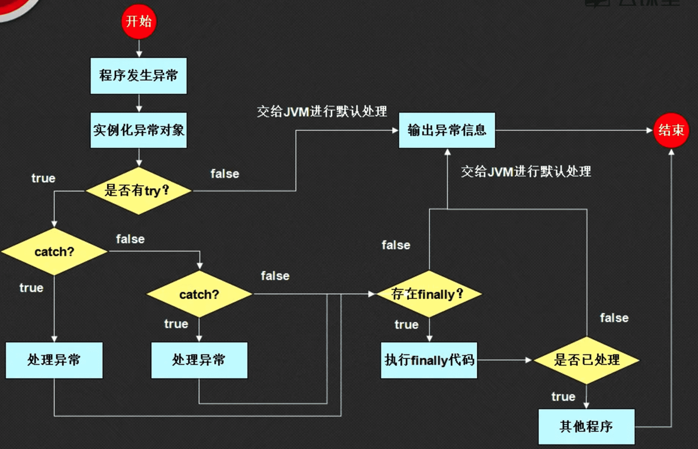

异常是java的一个重大特色，合理使用异常的功能可以使我们的程序变得更加的健壮。异常是导致程序中断执行的指令流，它一旦出现并没有记性合理处理的话，那么程序将中断执行。那么异常处理的目标就是，既能让异常产生，还能让程序继续运行。

## 1.异常的产生

下面是一段没有异常的代码：

```java
public class Hello{
	public static void main(String[] args){
		System.out.println("计算开始");
		System.out.println("执行计算："+ 10/2);
		System.out.println("计算结束");
	}
}
```

输出的结果：

```java
计算开始
执行计算：5
计算结束
```

现在改一下代码，让其产生异常：

```java
public class Hello{
	public static void main(String[] args){
		System.out.println("计算开始");
		System.out.println("执行计算："+ 10/0);   //异常产生处
		System.out.println("计算结束");
	}
}
```

输出如下：

```java
计算开始
Exception in thread "main" java.lang.ArithmeticException: / by zero
	at Hello.main(Hello.java:4)
```

可以看到，程序只执行了异常出现之前的代码，出错的地方，以及出错之后的代码都没有执行。

## 2.处理异常

处理异常的目的是使程序从头到尾执行完毕，java提供了三个可以处理异常的关键字：try、catch、finally，使用语法如下：

```java
try{
	// 有可能出现异常的语句
}[ catch (异常类型,对象){
	// 异常处理
}catch (异常类型,对象){
	// 异常处理
}catch (异常类型,对象){
	// 异常处理
}...] [finally {
	// 不管是否出现异常，都执行的统一代码
}]
```

上面是一个标准的使用语法，在开发中我们可以使用下面的组合，处理异常：

-   try….catch
-   try….catch….finally
-   try….fianlly(不推荐)

我们使用异常处理搭配，处理上面程序中的异常：

```java
public class Hello{
	public static void main(String[] args){
		System.out.println("计算开始");
		try{
			System.out.println("执行计算："+ 10/0);
		}catch (ArithmeticException e){
			System.out.println("****出现异常了****");
		}
		System.out.println("计算结束");
	}
}
```

输出如下：

```bash
计算开始
****出现异常了****
计算结束
```

这样就达到了既然异常产生，还能让程序继续运行的目的。但是这里又出现了另外一个问题，之前没有异常处理的时候，我们还能知道哪里出现了异常，但是使用了异常处理之后，我们却只能得到一个异常处理的提示，有什么办法能够得到异常产生的具体信息呢？使用`printStackTrace()`方法进行异常信息的完整输出。于是我们改进上面的代码：

```java
public class Hello{
	public static void main(String[] args){
		System.out.println("计算开始");
		try{
			System.out.println("执行计算："+ 10/0);
		}catch (ArithmeticException e){
			e.printStackTrace();
		}
		System.out.println("计算结束");
	}
}
```

输出结果如下：

```bash
计算开始
java.lang.ArithmeticException: / by zero
	at Hello.main(Hello.java:5)
计算结束
```

这样就能实现，即获取异常具体信息，还能让程序继续运行的目的。

## 3.异常处理流程(核心)

上面已经讲解了异常处理的格式，但是以上的操作并不是最好的异常处理方法，我们还需要清楚java整个异常的处理流程。首先我们先来观察一下两个异常：`ArithmeticException`

```bash
java.lang.Object
	java.lang.Throwable
		java.lang.Exception
			java.lang.RuntimeException
				java.lang.ArithmeticException
```

还有一个：`NumberFormatException`

```bash
java.lang.Object
	java.lang.Throwable
		java.lang.Exception
			java.lang.RuntimeException
				java.lang.IllegalArgumentException
					java.lang.NumberFormatException
```

经过观察发现，所有的异常都是`Throwable`的子类，因此我们来看一下这个类：

```bash
Class Throwable
	java.lang.Object
		java.lang.Throwable
	All Implemented Interfaces:
		Serializable
	Direct Known Subclasses:
		Error, Exception
```

在Throwable下有两个子类：Error、Exception，这两者的区别（面试题）：

-   Error：指JVM错误，即此时的程序还没有执行，用户也无法处理。
-   Exception：程序运行中产生的异常，用户是可以处理的。

也就是所谓的异常处理就是所有的Exception以及它的子类异常。下面是一张异常的处理流程：



-   当程序运行中出现了异常后，会由JVM自动根据异常的类型，实例化一个与之匹配的异常类的异常类对象，用户无需关心new，系统自动处理。
-   产生了异常之后，会判断当前的语句上是否存在异常处理，如果没有异常处理，那么就交给JVM进行默认的异常处理，处理的方式就是，输出异常信息，结束方法调用，后面的代码都不执行了。
-   如果此时存在有异常捕获操作，那么会由try语句来捕获产生的异常实例化对象。然后与每一个catch后的对象进行比较，如果现在有符合的捕获类型，则使用当前catch语句来进行异常的处理。如果不匹配则向下匹配其他的catch
-   不管异常是否正常被捕获，都会向后执行，如果此时有finally语句，那么就执行其中的代码，但是执行完毕之后，需要根据之前的catch匹配结果来决定如何执行接下来的语句，如果异常都已经被catch捕获了，那么继续往后执行，如果有没有被捕获的异常，那么还是要交给JVM来进行异常处理，也就是输出异常信息，然后终止程序运行

整个过程就好像是方法重载一样，根据catch后的参数类型，进行匹配，但是所有的java对象都带有自动的向上转型操作支持，也就是说，如果要真的匹配类型，简单的做法是，直接匹配`Exception`这一个最大的错误类型就够了，因为其他的错误类型都是这个类型的子类。因此代码可以改成：

```java
public class Hello{
	public static void main(String[] args){
		System.out.println("计算开始");
		try{
			System.out.println("执行计算："+ 10/0);
		}catch (Exception e){
			e.printStackTrace();
		}
		System.out.println("计算结束");
	}
}
```

这样就能捕获到所有的异常了，而无需精确匹配任意的错误。但是有两点需要说明：

-   捕获范围大的异常一定要放在捕获范围小的后面，否则程序无法执行，比如：

```java
try{
    System.out.println("执行计算："+ 10/0);
}catch (Exception e){
    e.printStackTrace();
}catch (NumberFormatException e){
    e.printStackTrace();
}
```

在捕获具体的`NumberFormatException`异常之前，Exception已经将其捕获了，因此会报错，但是这样改就好了：

```java
try{
    System.out.println("执行计算："+ 10/0);
}catch (NumberFormatException e){
    e.printStackTrace();
}catch (Exception e){
    e.printStackTrace();
}
```

-   在一些严格的项目里，不适合范范地使用Exception捕获异常，因为这样的话所有的异常都会使一种处理方法。所以建议按情况分开处理

##4.Throws关键字

throws关键字主要用于方法的声明，指的是方法中出现异常后，交由被调用出来处理:

```java
class MyMath{
	public static int div(int x, int y) throws Exception{
		return x / y;
	}
}

public class Hello{
	public static void main(String[] args){
		try{
			System.out.println(MyMath.div(10,5));
		}catch (Exception e){
			e.printStackTrace();
		}
	}
}
```

调用了使用throws关键字修饰的方法之后，必须在外面加上try….catch 语句。

既然主方法也属于方法，我们也可以使用throws关键字修饰主方法，修饰后，如果主方法里出现了错误，那么它会抛给JVM来处理，也就是抛出异常信息，终止程序进行。但是不建议这样做，了解一下即可：

```java
class MyMath{
	public static int div(int x, int y) throws Exception{
		return x / y;
	}
}

public class Hello{
	public static void main(String[] args) throws Exception{
		System.out.println(MyMath.div(10,5));
	}
}
```

##5.throw关键字

我们还可以使用throw关键字，自己定义异常并抛出：

```java
public class Hello{
	public static void main(String[] args){
		try{
			throw new Exception("自己定义的异常");
		}catch(Exception e){
			e.printStackTrace();
		}
	}
}
```

输出结果为：

```java
java.lang.Exception: 自己定义的异常
	at Hello.main(Hello.java:4)
```
这里再说一个小小的面试题：throws和throw有什么区别？

-   throw：指方法之中人为抛出一个异常类对象，这个实例化对象可能是自己实例化的，或者是抛出已经存在的。
-   throws：这是在方法的声明上定义的，一旦发生异常，将会给被调用处处理

## 6.异常的使用格式

```java
class MyMath{
	public static int div(int x, int y) throws Exception {
		int result = 0;
		System.out.println("***1.计算开始***");
		try{
			result = x / y;
		}catch (Exception e){
			throw e;
		}finally{
			System.out.println("***1.计算结束***");
		}
		return result;
	}
}

public class Hello{
	public static void main(String[] args){
		try{
			System.out.println(MyMath.div(10,2));
		}catch (Exception e){
			e.printStackTrace();
		}
	}
}
```

上面就是一个比较经典的try..catch…finally的异常处理形式，但是我们还可以将其省略称try….finally：

```java
class MyMath{
	public static int div(int x, int y) throws Exception {
		int result = 0;
		System.out.println("***1.计算开始***");
		try{
			result = x / y;
		}finally{
			System.out.println("***1.计算结束***");
		}
		return result;
	}
}
```

虽然说结果是一模一样的，但是不提倡，因为这样做我们就不能手动处理异常了，因为一旦发生异常立马就交给了调用出，你下不了手。

##7.RuntimeException类

首先写一个普通的代码

```java
public class Hello{
	public static void main(String[] args){
		int temp = Integer.parseInt("100");
	}
}
```

然后我们去文档找到parseInt这个函数，

```java
public static int parseInt(String s) throws NumberFormatException
```

可以看到此函数使用了throws关键字抛出了异常，按道理说，我们在调用的时候必须要加上try….catch才能够使用，答案是我们并没有，这是为什么呢？我们来看一下NumberFormatException的继承结构：

```java
java.lang.Object
	java.lang.Throwable
		java.lang.Exception
			java.lang.RuntimeException
				java.lang.IllegalArgumentException
					java.lang.NumberFormatException
```

我们可以看到，`NumberFormatException`是`RuntimeException`子类，`RuntimeException`是表示运行时异常，该异常的一大特色就是不会强制用处处理异常，一旦异常产生，将会抛给JVM来处理。用户也可以根据自己的需要选择行的处理。也就是说`RuntimeException子异常类，可以根据用户选择处理。

面试题：Exception  和RuntimeException的区别？常见的RuntimeException有哪些？

-   Exception是RuntimeException的一个父类
-   Exception定义的异常必须要被处理，而RuntimeException的异常不用手动处理。
-   常见的RuntimeException有：算术异常：ArithmeticException，空指向异常：NullPointerException

##8.断言assert

JDK1.4的时候引入的，其主要功能是进行断言。断言指的是判断程序执行到某行代码处时是否是预期的结果。

```java
public class Hello{
	public static void main(String[] args){
		int num = 10;
		// 这里经过了一系列的num的操作，打算将其变为20，于是断言一下
		assert num == 20 : "num此处不是20";
		System.out.println(num);
	}
}
```

编译运行后程序能够正常输出，因为assert 默认不会影响程序的运行，如果要影响的话，在运行的时候 加入参数：

```bash
java -ea Hello
```

此时会报错：

```bash
Exception in thread "main" java.lang.AssertionError: num此处不是20
	at Hello.main(Hello.java:5)
```

断言的内容了解一下即可。

## 9.自定义异常

虽然说java提供了各种各样的异常，但仍然不够用。这是就需要我们自己去定义一些异常了。定义的时候继承Exception或者RuntimeException类。一个是强制处理，一个是选择处理。

## 10.总结

-   Exception的父类是Throwable，但是我们在编写代码的时候，尽量不要去使用Throwable，因为throwable下面还有一个ERROR子类，我们能够处理的只有Exception子类。
-   异常处理的标准格式：try、catch、finally、throw、throws一起使用
-   要清除RuntimeException和Exception的区别