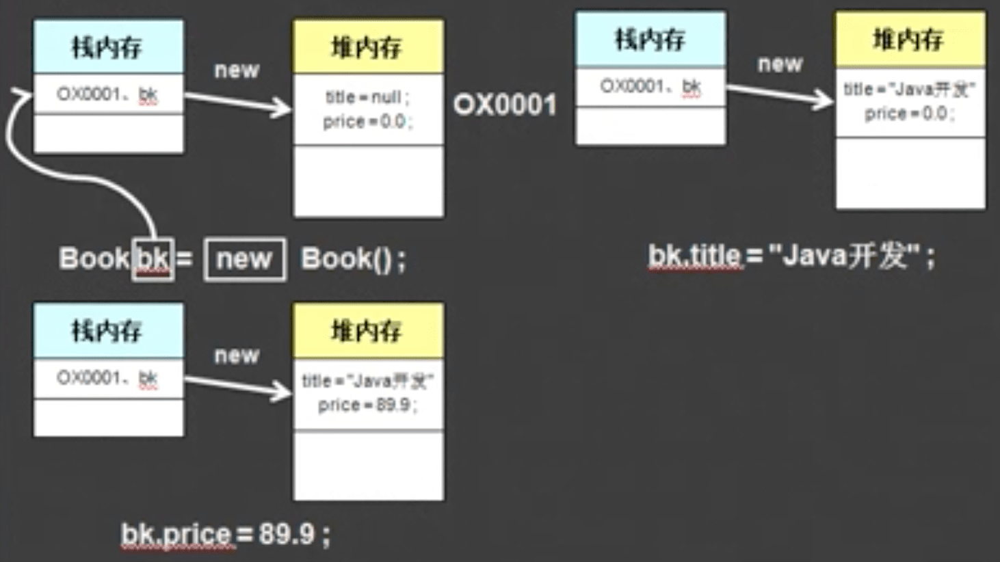
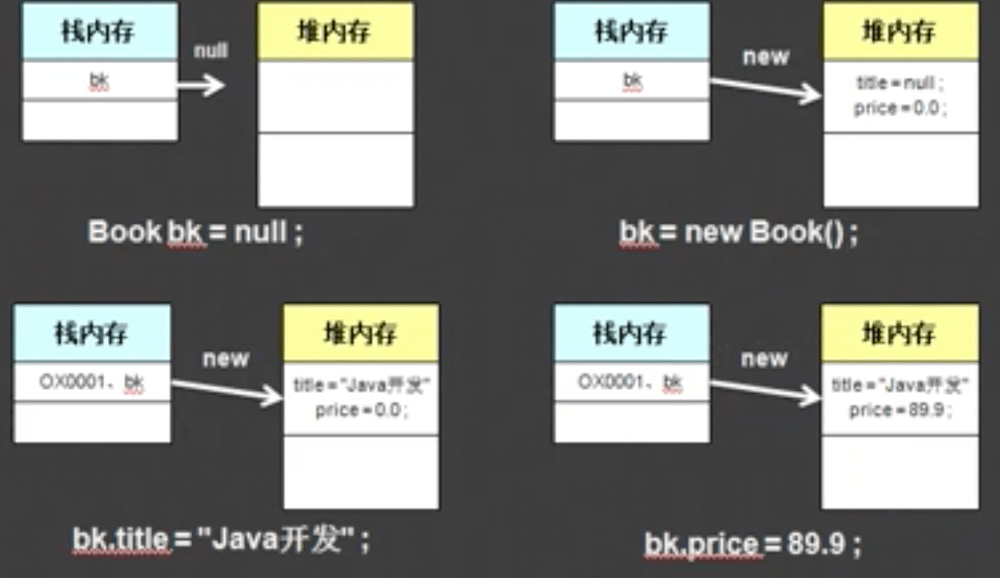
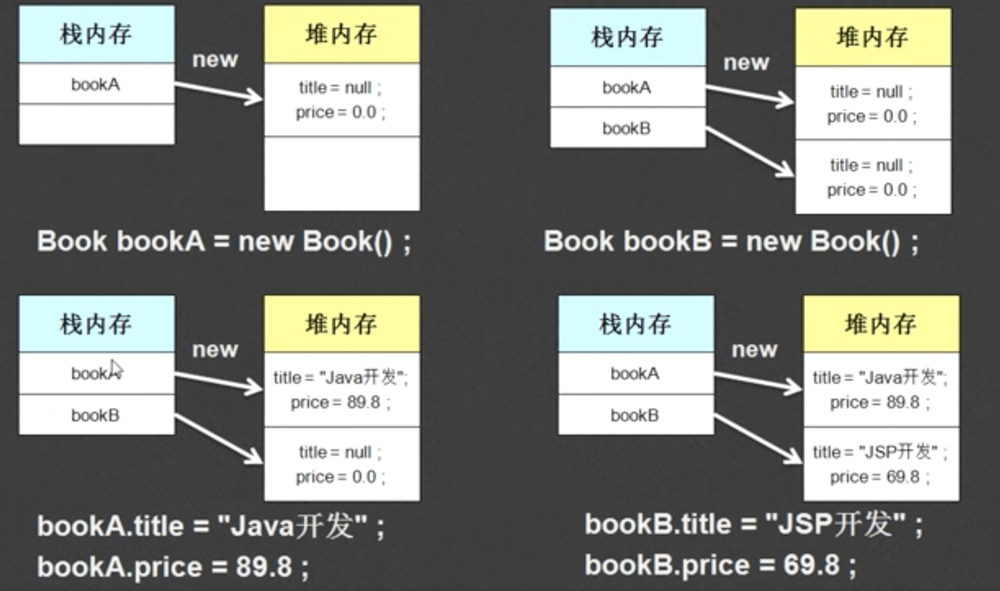
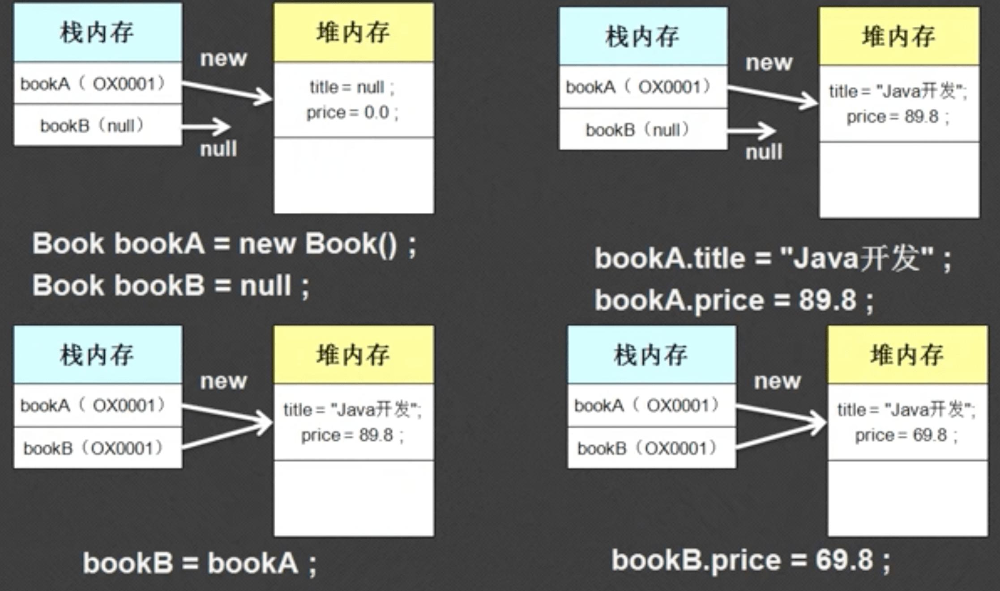
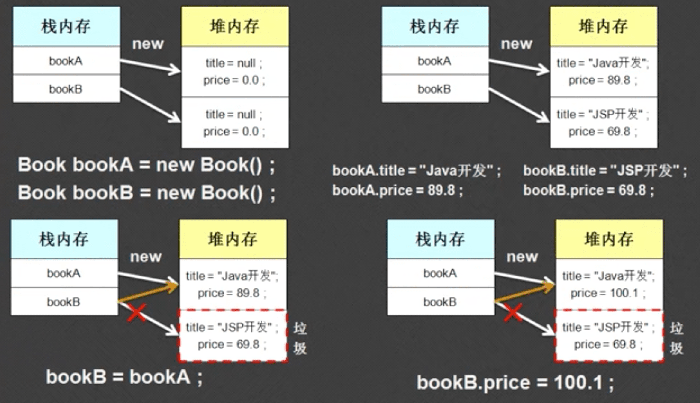

2019.3.27

## 1. 面向对象的特征

- 封装性：保护内部结构安全性
- 继承性：在已有的结构上开发新的特性
- 多态性：在某一个概念范围内满足

## 2. 面向对象开发步骤

- OOA：面向对象分析
- OOD：面向对象设计
- OOP：面向对象编程

## 3. 认识类与对象

- 面向对象就是一种组件化的设计思想。
- 类是共性的集合，对象是某一个性的产物
- 类不能直接使用，对象能直接使用
- 没有定义在主类里面的方法都不用加static

## 4.实例化对象的两种方法

### 4.1 声明并实例化

类名称 对象名称 =  new 类名称( )



### 4.2 分布完成

- 声明对象：类名称 对象名称 =null；
- 实例化对象：对象名称 = new 类名()



因为基本数据类型和引用数据类型的主要区别就在于内存的开辟和使用，所以关键字new的作用就是开辟内存。

只要是引用数据类型想使用，就必须用new来开辟空间

## 5. 对象的使用

- 对象.属性：操作类中的属性
- 对象.方法：操作对象中的方法

```java
// 自己定义的类
class Book{
	String title;
	double price;
	public void getInfo(){
		System.out.println("图书的名称："+title+",图书的价格："+price);
	}
	
}

// 主类
public class Hello{
	public static void main(String[] args){
		Book bk = new Book();
		bk.title = "月亮";
		bk.price = 90.0;
		bk.getInfo();
	}
}
```

## 6. 两个内存空间

- 堆内存：保存每一个对象的属性内容，堆内存需要用关键词new才可以开辟
- 栈内存：保存的是一块堆内存的地址
- 任何情况下只要是看到了new，就代表开辟了一块堆内存
- 一旦堆内存开辟了，开堆内存中一定含有定义的类属性的内容，所有的属性都是对性数据类型的默认值

## 7.引用数据的初步分析

- 引用类似于c++中的指针概念
- 所有引用分析中，最重要的还在于关键字“new”
- 使用关键字“new”实例化了两个对象，那么一个对象将占用一个堆内存，不会相互影响
- 

- 对象的引用传递

- ```java
  // 自己定义的类
  class Book{
  	String title;
  	double price;
  	public void getInfo(){
  		System.out.println("图书的名称："+title+",图书的价格："+price);
  	}
  	
  }
  
  // 主类
  public class Hello{
  	public static void main(String[] args){
  		Book bkA = new Book();
          Book bkB = null
  		bkA.title = "月亮";
  		bkA.price = 90.0;
  		
          bkB = bkA	//引用传递
          bkB.price = 99.8
          bkA.getInfo();
  	}
  }
  ```

- 严格来说bkA和bkB保存的是对象的地址信息

- 也就是说上面的引用就是讲bkA的地址给了bkB，bkB能够修改bkA的内容

- 

- 一块堆内存能够被多个栈内存所指向，但是一块栈内存智能保存 一块堆内存的地址信息
- 先后声明并实例化两个对象后，再将其中一个引用给另外一个的内存分配：
- 

- 没有被栈内存指向的堆内存就被称为垃圾，垃圾会不定期的被垃圾收集器（GC）回收，然后释放

