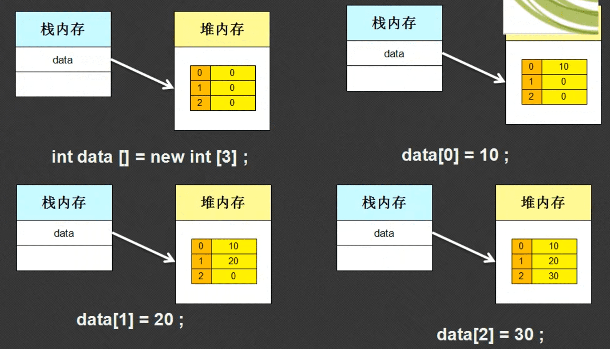
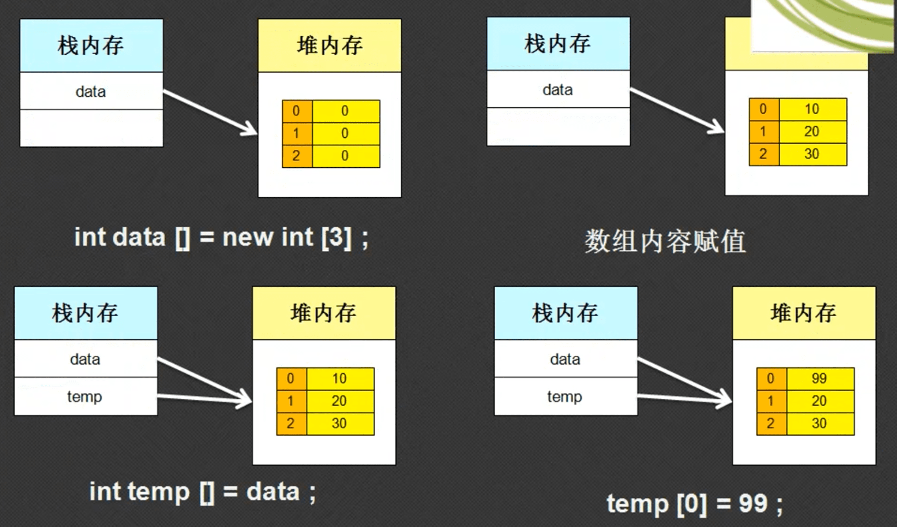
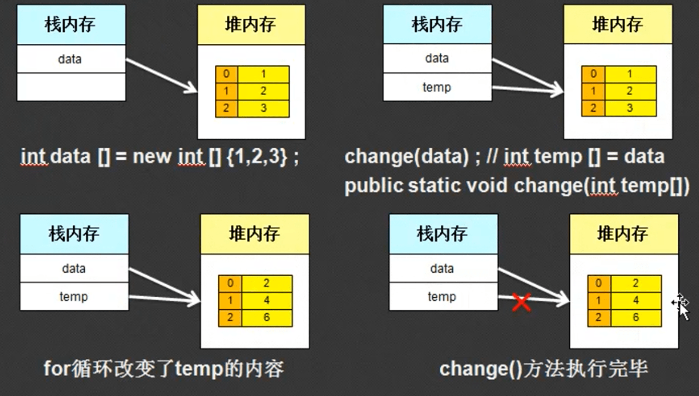

## 1. 数组的概念

- 数组就是一组相关变量的集合，比如用数组可以实现100个变量的定义。
- 数组的动态初始化定义：
  - 声明并开辟数组：数据类型  数组名称[ ]  = new 数据类型[长度] 
  - 分步定义：
    - 声明数组：数据类型  数组名称[ ] = null;
    - 开辟数组：数组名称 = new 数据类型[长度] 
  - 可以看出来声明数组的时候才使用[ ]

- 数组的静态初始化定义：

  - 一、简化格式：数据类型  数组名[ ] = {值，值，值….}

  - 二、完整格式：数据类型 数组名[ ] = new 数据类型[ ] {值，值，...}

  - ```java
    public class Hello{
        public static void main(String args[]){
            int arr[] = new int[]{1,2,3,4,5};
            for(int x=0; x<arr.length; x++ ){
                System.out.println(arr[x]);
            }
        }
    }
    ```

- 数组的访问：数组名称[下标 | 索引]、所有的下标都是从0开始的

- 获取数组长度：数组名称.length

- 循环获取数组所有的元素

- ```java
  public class Hello{
      public static void main(String args[]){
          int arr[] = new int[3];
          arr[1] = 123;
  
          for(int x=0; x<arr.length; x++ ){
              System.out.println(arr[x]);
          }
      }
  }
  ```

- 由于数组属于引用数据类型，所以他的最麻烦的地方在于内存的分配。

- 对象中的堆内存保存的是属性，而数组中的堆内存保存的是一组信息

- 

## 2. 数组的引用传递

引用传递本质上就是堆内存被多个栈内存所指向

```java
public class Hello{
    public static void main(String args[]){
        int arr[] = new int[3];
        arr[0] = 10;
        arr[1] = 20;
        arr[2] = 30;

        int temp[] = arr; //arr的地址传递给temp数组、就完成了数组的引用传递
		temp[0] = 99;
        for(int x=0; x<arr.length; x++ ){
            System.out.println(arr[x]);
        }
    }
}

//输出是
99
20
30
```



## 3.注意

- 工作中一般是通过数据传递的方法使用数组，不会主动开辟空间再去使用。
- 数组的最大缺点是长度不能改变。

## 4. 二维数组

- 二维数组就是有两个[ ]
- 二维数组的定义
  - 动态定义：数组类型 数组名\[ ][ ] = new 数组类型[ 行长度 ] [ 列长度 ] 
  - 静态定义：数组类型 数组名\[ ][ ] = new 数组类型\[  ][  ]  {{值，值，值},{值，值，值}}

- 注意：实际开发中很少出现直接编写的二维数组。

## 5.数组与方法的参数传递

之前学的方法里面传入的参数基本上都是基本数据类型、当传入的是数组的时候，一定要注意观察内存分配图。如下面的

### 5.1 数组传递的范例：

```java
public class Hello{
    public static void main(String[] args){
        // 定义数组
        int arr[] = new int[] {1,2,3,4,5};
        
        // 将上面的数组传入到调用的函数中
        change(arr);

        // 输出数组的元素
        for(int i=0; i<arr.length; i++){
            System.out.println(arr[i]);
        }
    }

    // 此方法定义在主类中，由主方法直接调用
    public static void change(int[] temp){
        for(int i=0; i<temp.length; i++){
            temp[i] *= 2;
        }
    }
}

//输出是
2
4
6
8
10
```

上面的代码与下面的代码实现的结果是一样的

```java
public class Hello{
    public static void main(String[] args){
        // 定义数组
        int arr[] = new int[] {1,2,3,4,5};
        
        // 定义另一个数组，将arr引用传递给它
        int temp[] = arr;

        // 对temp的元素*=2
        for(int i=0; i<temp.length; i++){
            temp[i] *= 2;
        }

        // 输出数组的元素
        for(int i=0; i<arr.length; i++){
            System.out.println(arr[i]);
        }
    }
}
```

也就是说、将一个数组作为参数传入到函数中，实际上是传入的该数组的栈内存中存储的堆内存的地址，方法对数组做的修改一定会被保留下来。内存中的改变如下：



### 5.2 一个数组的冒泡排序算法

升序排序的基本算法，按顺序两两比较，后者小于前者则交换位置

原始数据：2、1、9、0、5、3、7、6、8；

第一次排序：1、2、0、5、3、7、6、8、9

第二次排序：1、0、2、3、5、6、7、8、9

第三次排序：0、1、2、3、5、6、7、8、9

按照此种方法进行排序次数（大的次数）不会操作数组的总长度，所以只要排序总次数

```java
public class Hello{
    public static void main(String[] args){
        int arr[] = new int[] {2,1,9,0,5,3,7,6,8};
        printOut(arr,"排序前的输出");
        order(arr);
        printOut(arr,"排序后的输出");
    }

    // 此函数用于排序
    public static void order(int temp[]){
        for(int j=0; j<temp.length; j++){
            for(int i=0; i<temp.length-1; i++){
                int container = 0;
                if(temp[i] > temp[i+1]){
                    container = temp[i];
                    temp[i] = temp[i+1];
                    temp[i+1] = container;
                }
            }
        }   
    }

    // 此函数用于输出
    public static void printOut(int temp[],String printType){
        System.out.println(printType);
        for(int i=0; i<temp.length; i++){
            System.out.println(temp[i]);
        }
    }
}

// 输出结果
排序前的输出
2
1
9
0
5
3
7
6
8
排序后的输出
0
1
2
3
5
6
7
8
9
```

### 5.3 实现数组的转置（首位交换）

原始数组：1,2,3,4,5,6,7,8,9

转置后的数组：9,8,7,6,5,4,3,2,1

思路一：定义一个新的数组，将源数组按倒序插入到新的数组里面，但是这种方式会产生垃圾，不推荐使用

```java
public class Hello{
    public static void main(String[] args){
        int arr[] = new int[] {1,2,3,4,5,6,7,8,9};
        printOut(arr,"转之前的输出");
        transpose(arr);
    }

    // 此函数用于转置
    public static void transpose(int temp[]){
        // 动态定义一个新的数组
        int newArr[] = new int[temp.length];
        int i,j;
        for(i=temp.length-1,j=0; i>-1 && j<temp.length; i--,j++){
            newArr[j] = temp[i];
        }
        printOut(newArr,"转置后的输出");
    } 

    // 此函数用于输出
    public static void printOut(int temp[], String printType){
        System.out.println(printType);
        for(int i=0; i<temp.length; i++){
            System.out.print(temp[i]+" ");
        }
        System.out.println('\n');
    }
}

// 输出结果
转之前的输出
1 2 3 4 5 6 7 8 9 
转置后的输出
9 8 7 6 5 4 3 2 1 
```

思路二：直接在源数组的基础上进行转置

```java
public class Hello{
    public static void main(String[] args){
        int arr[] = new int[] {1,2,3,4,5,6,7,8,9};
        printOut(arr,"转之前的输出");
        transpose(arr);
        printOut(arr,"转之后的输出");
    }
    // 此函数用于转置
    public static void transpose(int temp[]){
            for(int i=0; i<= (temp.length-1)/2; i++){
                int container = 0;
                container = temp[i];
                temp[i] = temp[temp.length-1-i];
                temp[temp.length-1-i] = container;
            }
    } 
    // 此函数用于输出
    public static void printOut(int temp[], String printType){
        System.out.println(printType);
        for(int i=0; i<temp.length; i++){
            System.out.print(temp[i]+" ");
        }
        System.out.println('\n');
    }
}
```

### 5.4 方法返回数组

重点关注方法的返回值就可以了

```java
public class Hello{
    public static void main(String[] args){
        System.out.println(init().length);
    }
    public static int[] init(){
        // 返回一个匿名数组
        return new int[] {1,2,3};
    }
}
```

## 6.两个与数组相关的系统内置方法

### 6.1 数组的拷贝

- 概念：将数组中的部分内容拷贝到另外一个数组之中
- 语法：System.arraycopy(原数组名称，原数组拷贝开始索引，目标数值名称，目标数组拷贝开始索引，拷贝长度)

举例：实现数组拷贝

- 数组A：1，2，3，4，5，6，7，8
- 数组B：11，22，33，44，55，66，77，88
- 要求拷贝后的数组B：11，22，5，6，7，66，77，88

```java
public class Hello{
    public static void main(String[] args){
        int arrA[] = new int[] {1,2,3,4,5,6,7,8};
        int arrB[] = new int[] {11,22,33,44,55,66,77,88};

        System.arraycopy(arrA,4,arrB,2,3);
        for(int i=0; i<arrB.length; i++){
            System.out.println(arrB[i]);
        }
    }
}
```

### 6.2 数组的排序

- 语法：java.util.Arrays.sort(数组名)；

## 7.对象数组（重点）

- 说白了就是同时实例化多个类，将其放到一个数组当中，将多个对象交给数组统一管理

- 概念：引用类型里面嵌套了其他的引用类型，之前定义的数组都是用的基本数据类型的数组，但是所有的引用数据类型也同样可以定义数组，这样的数组称为对象数组。二维数组其实也是对象数组
- 对象数组一般就是一维

- 动态初始化：
  - 声明并开辟对象数组：类名称  对象数组名称[]  = new 类名称[长度];
  - 分步完成：
    - 声明对象数组：类名称 对象数组名称[] = null;
    - 开辟对象数组：对象数组名称 = new 类名称[长度];   

- 静态初始化：类名称 对象数组名称[] = new 类名称[] {实例化对象，实例化对象}

```java
class Book{
    private String title;
    private int price;
    // 构造方法
    public Book(String t,int p){
        title = t;
        price = p;
    }
    // 输出信息 
    public String getInfo(){
        return "图书价格"+price+"，图书标题"+title;
    }
}

public class Hello{
    public static void main(String[] args){
        // 动态初始化对象数组
        Book bo[] = new Book[3];
        // 分别实例化对象
        bo[0] = new Book("java",23);
        bo[1] = new Book("Python",34);
        bo[2] = new Book("cv",45);
        // 输出所有对象信息
        for(int i=0;i<bo.length;i++){
            System.out.println(bo[i].getInfo());
        }
    }
}
```

## 8.总结

- 数组用的很少，但是一定会用，而且数组的相关逻辑比较麻烦
  - 把数组的转置和排序弄明白

- 一切以一位数组为主，要明白数组的定义语法和内存的关系（对象一致）
- 对象数组的定义语法，对象数组 = 多个对象
- 数组的天生最大短板：长度固定，所以这就限制了数组在开发中的出现
- 数组的排序：java.util.Arrays.sorts()