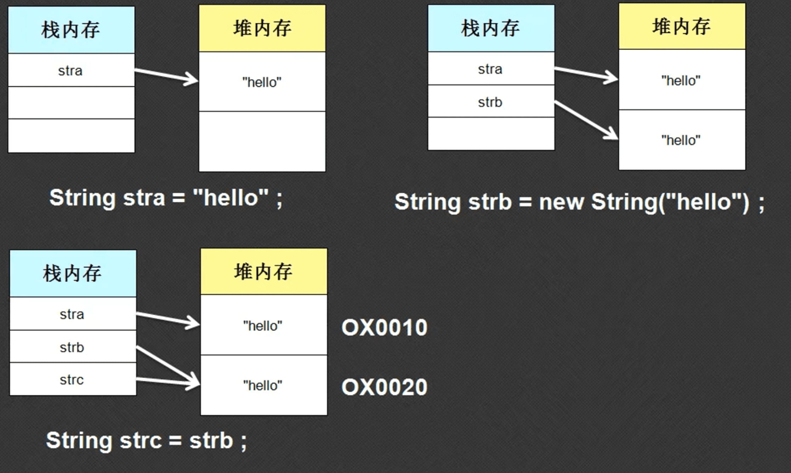
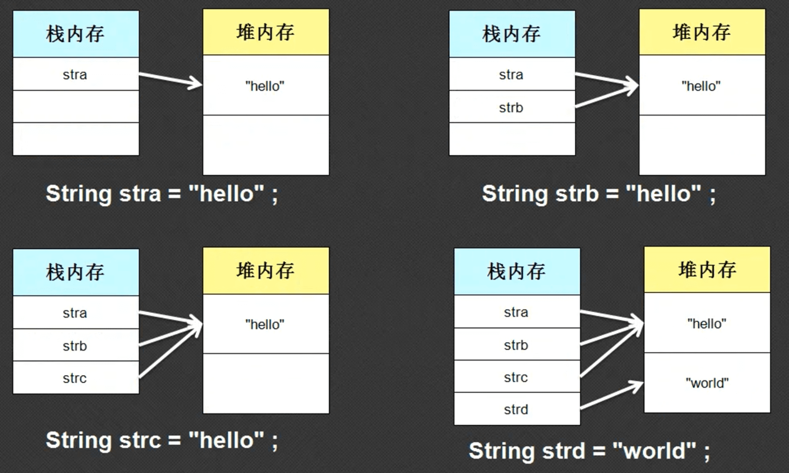
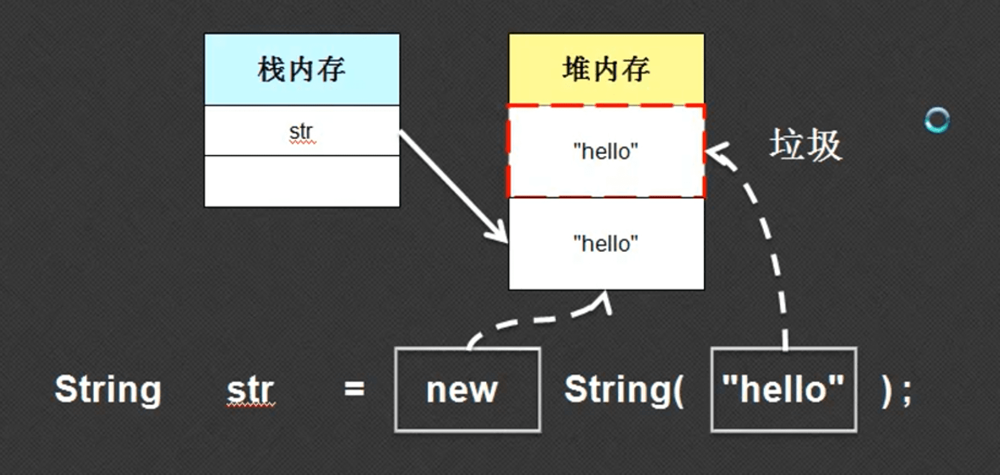
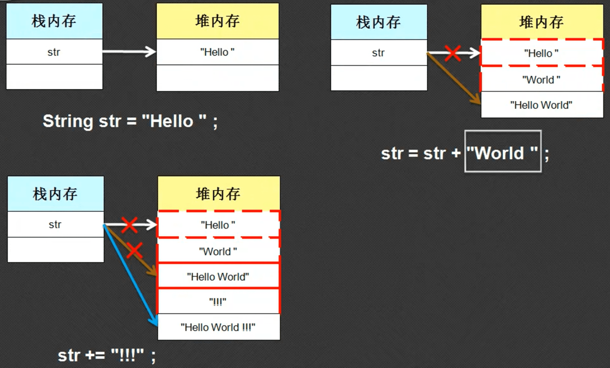

String是一个字符串类型的类，使用“"”定义的内容都是字符串，我们需要从类的角度和内存关系上分析这个类的作用。

## 1.String类对象的两种实例化方法

### 1.1直接赋值的方式实例化

 ```java
public class Hello{
    public static void main(String args[]){
        String str = "Hello World！！！";
        System.out.println(str);
    }
}
 ```


以上是字符串对象的直接赋值，该代码并没有使用关键字new 进行，String类中其实也定义了一个构造方法

- 构造方法：public String(String str)，在构造里面依然要接收一个本类对象
- 类的实例化语法：类名称 对象名称 =  new 类名称( )

### 1.2 使用关键字new实例化

```java
public class Hello{
    public static void main(String args[]){
        String str = new String("Hello World！！！");
        System.out.println(str);
    }
}
```

## 2.字符串的比较

int类型的数据可以使用“==”进行大小的比较，字符串同样也可以.

```java
public class Hello{
    public static void main(String args[]){
        String stra = "nihao";
        String strb = new String("nihao");
        String strc = strb;
        
        System.out.println(stra == strb); //false
        System.out.println(stra == strc); //false
        System.out.println(strc == strb); //true

    }
}
```

以上三个String类对象的内容可是完全一样的 ，得到的结果却不都是TRUE，下面从内存的角度分析:



可以看出字符串如果用“==”进行比较的话，其实比较的是内存的地址，地址相同则相同，不同则不同。如果需要计较字符串的话需要用到String类中的比较方法：

- 比较内容，与原始有一些差别：public boolean equals(String str)

```java
public class Hello{
    public static void main(String args[]){
        String str1 = "nihao";
        String str2 = new String("nihao");
        String str3 = str2;

        System.out.println(str1.equals(str2)); //true
        System.out.println(str1.equals(str3)); //true
        System.out.println(str3.equals(str2)); //true

    }
}
```

所以，以后在开发的过程中，如果要进行字符串内容是否相等的比较，一定不要使用“==”，而是要使用stra.equals(strb)的这种方法。

**面试题：**请解释在字符串相等判断中“==”与equals()的区别？

- ==是Java提供的关系运算符，主要的功能是进行数值相等判断，如果用在地址数值的比较，比较的是两个字符串地址的数值。而不是字符串内容本身。
- equals()是String类提供的一个专门用于比较字符串内容的方法。

## 3. 字符串常量就是String的匿名对象

实际上任何语言都没有字符串的概念，很多语言里面使用的是字符串数组，Java里面同样也没有字符串的概念。但是字符串是一个变成离不开的东西，Java自己创造了字符串的概念，但是此概念不是基本数据类型，他是将字符串作为了String类的**匿名对象**的形式存在的。

```java
public class Hello{
    public static void main(String[] args){
        String str = "hello";
        System.out.println("hello".equals(str)); //true
    }
}
```

从上面的代码中可以看出，一个用引号括起来的字符串是可以直接调用String类中的方法的，从而证实了字符串常量其实就是一个String类的匿名对象，另外字符串字节复制的方法实际上就是相当于给一个字符串匿名对象给名字的过程。区别在于，String类的匿名对象不是用户创建的，而是系统自动生成的。

小小技巧：为了避免空指向异常（使用了未实例化的对象，使用了未实例化的引用数据类型）的出现，可以将字符串写在前面调用方法。

```java
public class Hello{
    public static void main(String[] args){
        String str = null;
        System.out.println(str.equals("hello")); 
    }
}

//输出结果
Exception in thread "main" java.lang.NullPointerException
	at Hello.main(Hello.java:4)
```

可以看出，如果用一个空的字符串去调用String类的方法的话会产生空指向异常，但是如果用下面的方法就不会出现错误。因为equals处理了空的情况

```java
public class Hello{
    public static void main(String[] args){
        String str = null;
        System.out.println("hello".equals(str)); //false
    }
}
```

也就是说，在实际开发的过程中，如果需要对用户输入的数据跟一个字符串数据进行比较的话，请将字符串放在用户输入的内容前面。

## 4. 两种实例化方式的区别

### 4.1 分析直接赋值

直接赋值的实例化方法其实就是给一个匿名对上附一个名字。

```java
// String 字符串名 = new String(字符串值)
String str = "hello";
```

这样写会在内存中开辟一块栈内存，一块堆内存。

```java
public class Hello{
    public static void main(String[] args){
        String stra = "hello";
        String strb = "hello";
        String strc = "hello";
        String strd = "world";

        System.out.println(stra.equals(strb)); //true
        System.out.println(stra.equals(strc)); //true
        System.out.println(strb.equals(strc)); //true
        System.out.println(stra.equals(strd)); //false
        
    }
}
```

通过上面的代码我们发现，给一个匿名对象赋值给多个不同的名字，这些名字所指向的堆内存的地址是一样的。也就是说，采用直接赋值的String类对象的内存地址完全相同。stra, strb, strc指向的内存地址是相同的



共享设计模式：

在JVM的底层实际上会有一个对象池，（不一定只保存String对象），当代码之中使用了直接赋值的方式定义了一个String类对象的时候，会将此字符串对象所使用的匿名对象入池保存，此后如果还有String类对象采用直接赋值的方式，并且设置了同样内容的时候，那么将不会开辟新的堆内存空间，而是使用已有的对象进行引用的分配，从而继续使用。

## 4.2 采用构造方法实例化

构造方法如果要使用，一定要用关键词new，一旦使用了关键词new，就意味着开辟一块堆内存。

```java
String str = new String("hello");
```

这种方法赋值的内存分配如下：



语句是从右往左以此执行的，最右边是一个String的匿名对象，因此首先开辟一块堆内存，遇到关键字new 的时候又会开辟一个新的堆内存空间，里面存的也是hello，但是栈内存str保存的是new关键字开辟的堆内存，所以匿名对象开辟的堆内存就成为了垃圾。因此用构造方法实例化String对象的方式是不好的。

```java
public class Hello{
    public static void main(String[] args){
        String str = new String("hello");
        String stra = "hello";
        System.out.println(str == stra); //false
        
    }
}
```

从输出结果可以看出，由构造方法实例化的String对象是不会进入到对象池中，因为使用了关键词new。如果希望new开辟的对象也入池的话，可以使用手工的方法。public String intern();

```java
public class Hello{
    public static void main(String[] args){
        String str = new String("hello").intern();
        String stra = "hello";

        System.out.println(str == stra); //true
        
    }
}
```

### 4.3 面试题：请解释String类对象的两种实例化方法的区别：

- 直接赋值（String str = "字符串";）:只会开辟一块堆内存，而且实例化的对象会被放入对象池中，以待下次使用。
- 构造方法赋值（String str = new String("字符串")）：会开辟两块堆内存，其中匿名对象开辟的堆内存会被当做垃圾，不能被自动放入对象池中，需要用intern()方法手工入池。

## 5. 字符串一旦定义不会再改变。

```java
public class Hello{
    public static void main(String[] args){
        String str = "hello ";
        str += "world";
        str += "!!!";
        System.out.println(str);
    }
}
```

通过上面的操作，我们改变了字符串str的值，内存分析如此下：



可以发现上面的代码其实不是改变了“hello”的堆内存，而是在一步步str 的堆内存指向，同时此种方法还产生了很多的垃圾。

## 6.总结

String类的特点：

- String类对象的相等判断使用equals方法完成，"=="使用的是地址数值比较
- 字符串内容一旦声明则不可改变，String类对象内容的改变是依靠引用关系的改变而实现的。
- String类有两种实例化方法：直接赋值可产生一块堆内存，且对象能直接入池。不要使用构造方法实例化。